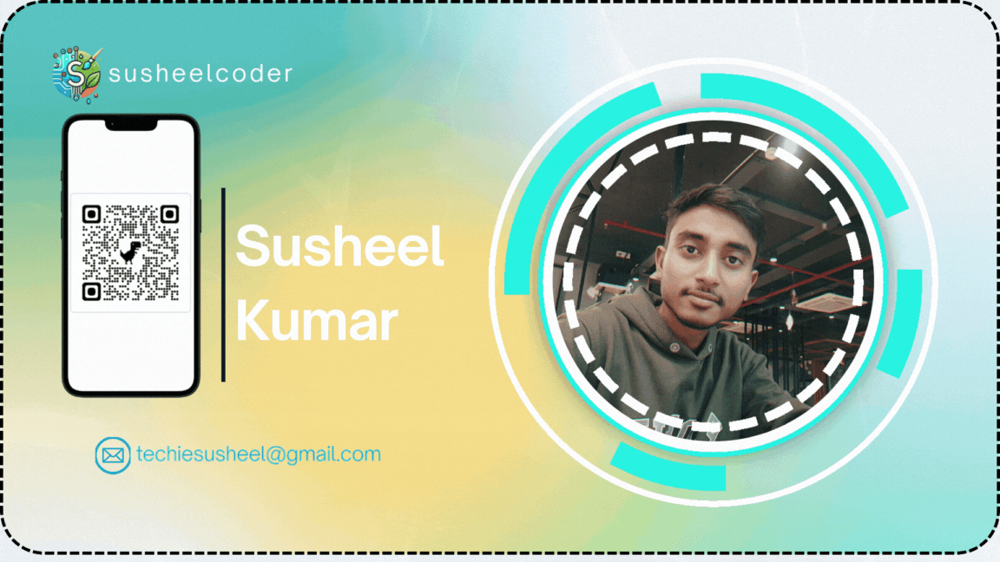

<!DOCTYPE html>
<html lang="en">
<head>

  <!-- ✅ Basic Meta Tags -->
  <meta charset="UTF-8">
  <meta name="viewport" content="width=device-width, initial-scale=1.0">
<!--   <title>Susheelcoder - Full Stack Developer & Portfolio</title> -->
  <meta name="description" content="Welcome to Susheelcoder - My personal website & portfolio showcasing my full stack development journey, projects, and skills.">
  <meta name="keywords" content="susheelcoder, Susheel Coder, Full Stack Developer, Portfolio Website, HTML, CSS, JavaScript, PHP, MySQL, Web Development, Responsive Design, Clean UI">
  <meta name="author" content="Susheelcoder">

  <!-- ✅ Open Graph (For Social Media like Facebook, LinkedIn) -->
  <meta property="og:title" content="Susheelcoder - Full Stack Developer & Portfolio">
  <meta property="og:description" content="Explore my projects, skills, and full stack development journey. Clean UI, responsive design, and modern web development.">
  <meta property="og:image" content="https://github.com/user-attachments/assets/058c385e-df26-48d5-905b-96e39b54d380">
  <meta property="og:url" content="https://susheelcoder.netlify.app/">
  <meta property="og:type" content="website">

  <!-- ✅ Twitter Card (For Twitter/X Sharing) -->
  <meta name="twitter:card" content="summary_large_image">
  <meta name="twitter:title" content="Susheelcoder - Full Stack Developer & Portfolio">
  <meta name="twitter:description" content="Welcome to my personal website & portfolio. Showcasing projects, skills, and full stack development journey.">
  <meta name="twitter:image" content="https://github.com/user-attachments/assets/058c385e-df26-48d5-905b-96e39b54d380">

  <!-- ✅ Favicon -->
  <link rel="icon" type="image/png" href="favicon.png">

</head>
<body>
    

<H1>🌐 susheelcode -Full Stack Developer & Portfolio</H1>

Welcome to <strong>susheelcoder</strong> — my personal website and portfolio! 
This project showcases my work, skills, and full stack development journey.

<h3>🚀 Features</h3>
<ul>
  <li>Responsive design (mobile & desktop friendly)</li>
  <li>Clean and modern UI</li>
  <li>Portfolio section to highlight projects</li>
  <li>Contact form for easy communication</li>
  <li>SEO friendly meta setup</li>
</ul>

<h3>🛠️ Tech Stack</h3>

  HTML  CSS  PHP MySQL  JavaScript  GitHub  XAMPP

<h3>📬 Contact</h3>

  Website: <a href="https://susheelcoder.netlify.app" target="_blank">https://susheelcoder.netlify.app</a> 
  Email: <a href="mailto:techiesusheel@gmail.com">techiesusheel@gmail.com</a>

  #susheelcoder #WebDevelopment #PortfolioWebsite #HTML5 #CSS3 #JavaScript #ResponsiveDesign #CleanUI #SusheelCoder

    
</body>
</html>
